# Membuat Migration dan Model
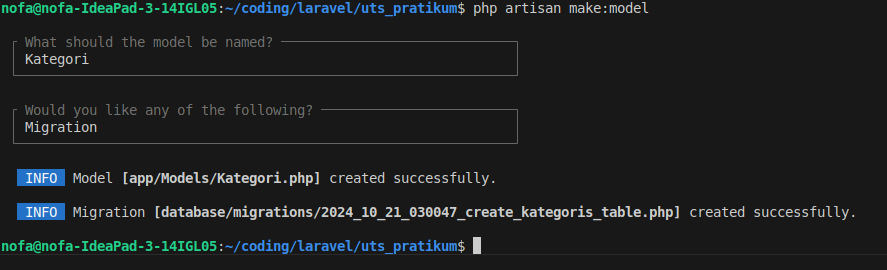

- **Edit file migration `create_kategoris_table.php`**
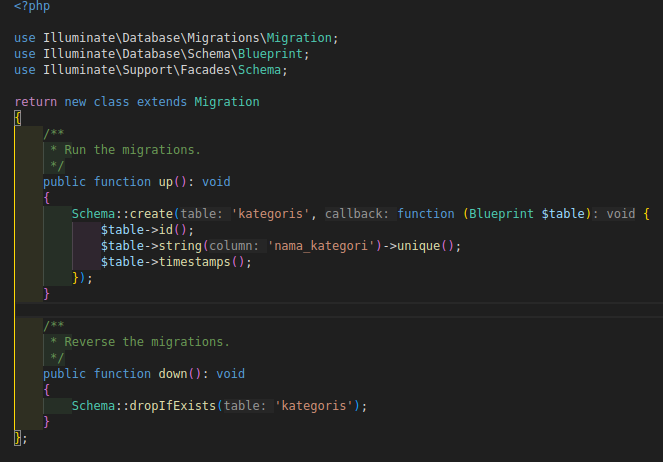

- **Edit file migration `create_bukus_table.php`**
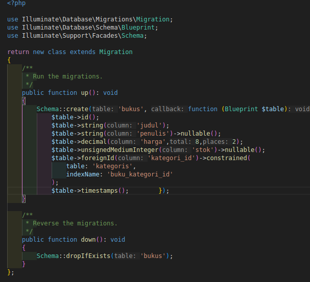

- **Menjalankan perintah `php artisan migrate`** 
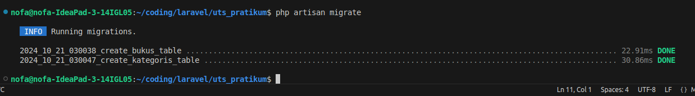

# Membuat Controller API untuk Kategori dan Buku
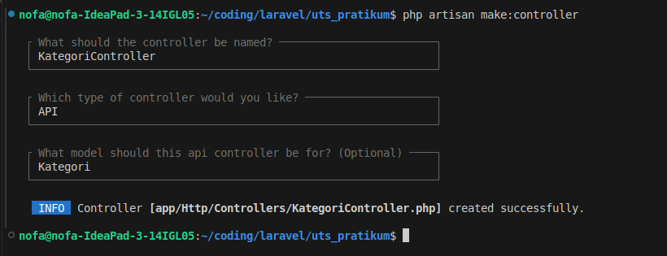

- **Isi file `KategoriController.php`** 
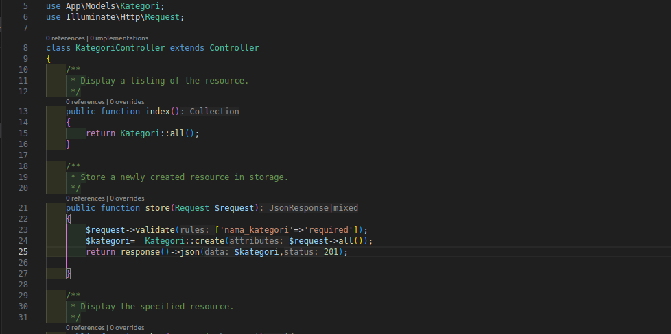

# Menambahkan Route API
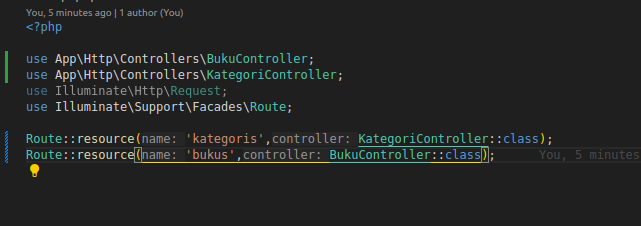

# GET Semua Kategori
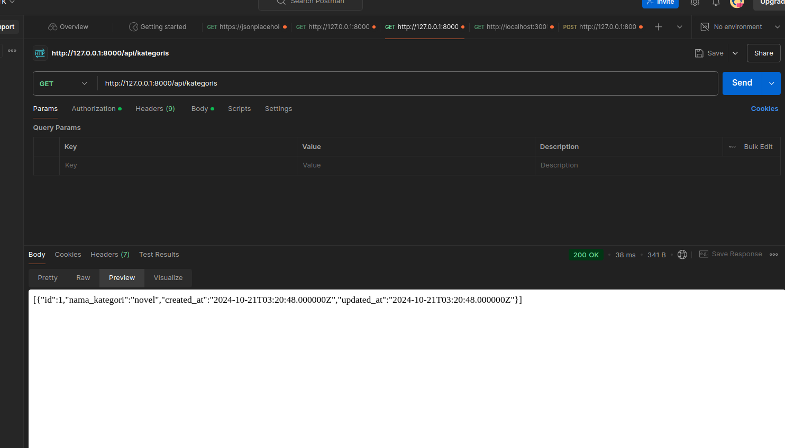

# POST Tambah Kategori Baru
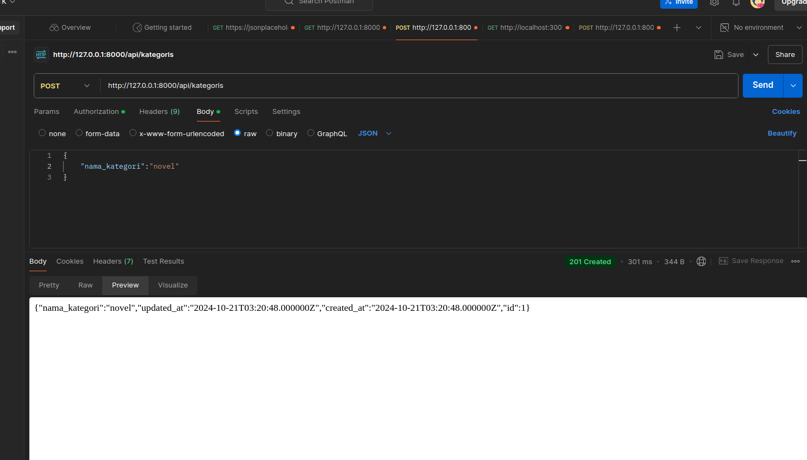

# POST Tambah buku Baru
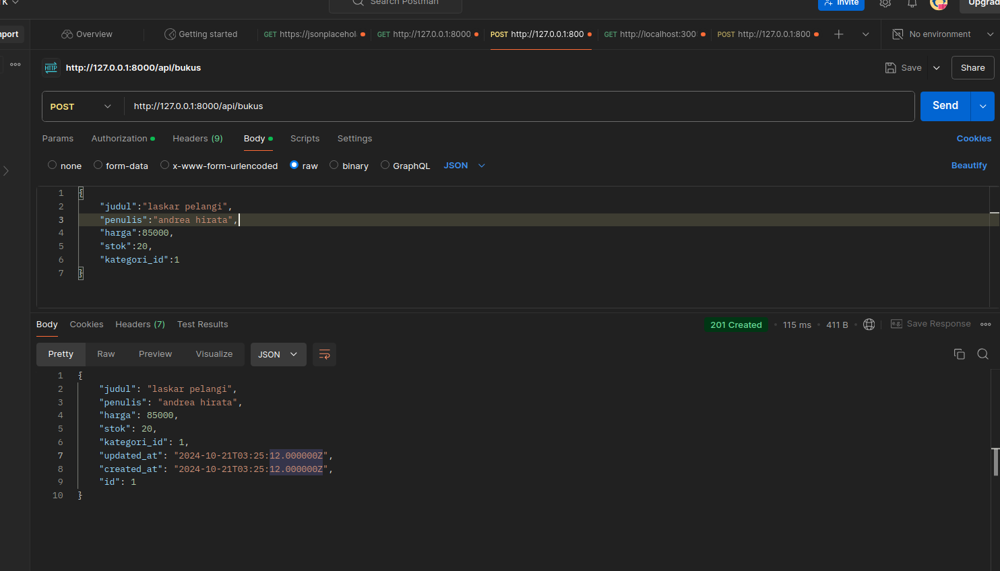

# GET Buku Berdasarkan ID
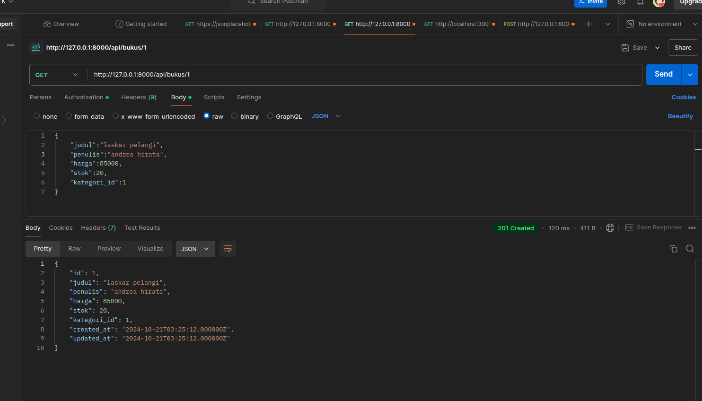

# PUT Update Data Buku
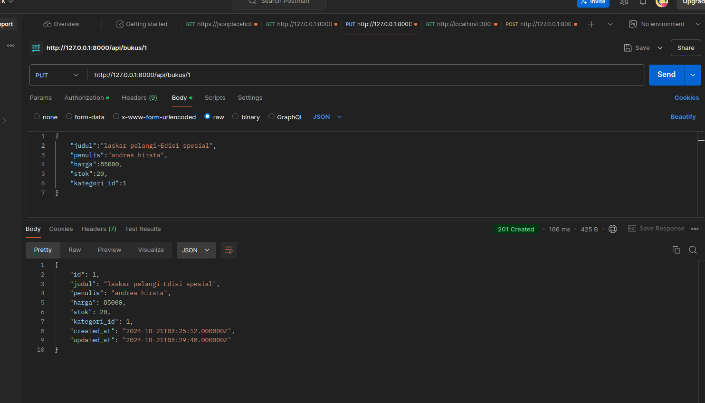

# DELETE Hapus Buku
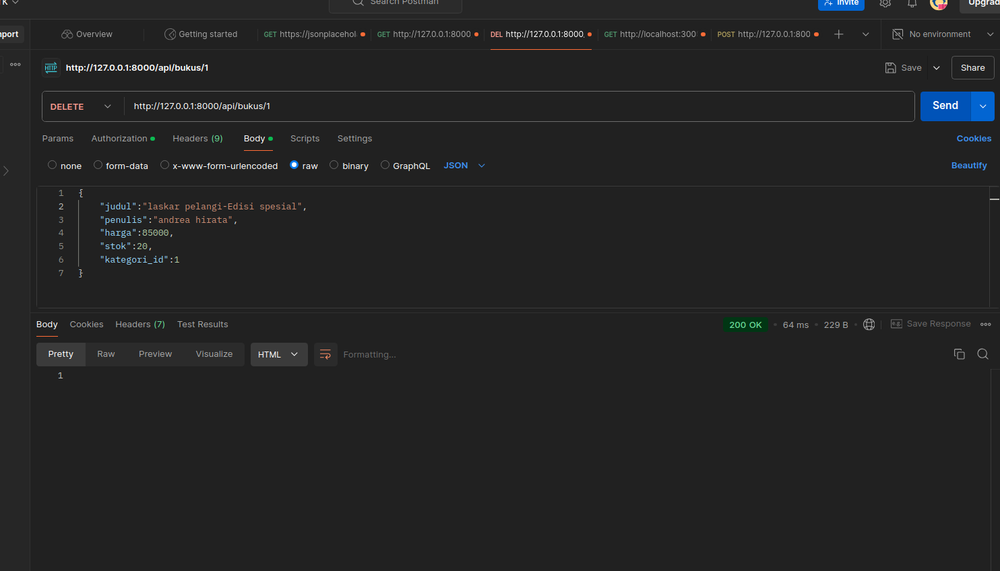
